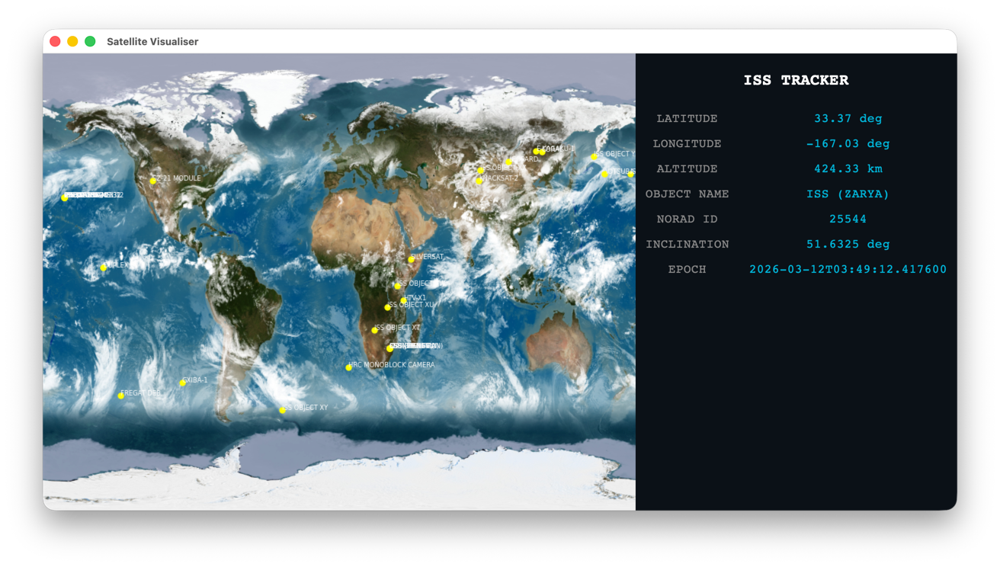

# ISS Bluesky Bot

Bluesky bot that posts pass predictions for Sheffield, UK.

---



# What the Project Is

- Tracks the ISS
- Makes pass predictions
- Posts on Bluesky

---

# How It Works

- API call to Celestrak returns OMM JSON data.
- Propagates orbit forward from TLE epoch to current time.
- Converts coordinate frames into Earth latitude/longitude.
- Applies GST rotation to account for Earth's rotation.

---

# Tech Stack

- Languages: Python
- Libraries: requests
- Tools: Celestrak

---

# What I Learned

- API calling
- Keplerian orbital mechanics
- Co-ordinate frame translation
- Orbital predictions

---

# Project Structure

```
├── LICENSE.md
├── README.md
├── main.py
├── propagator.py
├── requirements.txt
```

---

# How to Run the Project

```bash
git clone https://github.com/liampallett/satellite_visualiser.git
pip install -r requirements.txt
python main.py
```

---

# Future Improvements


---
